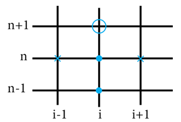

# Diffusion Equation Code 1D documentation

The code is based on the Du Fort and Frankel method (explicit unconditionally stable Finite difference method).

## Objectives/what it can do

## Requirements
Install ....

## Libraries
Python version
Libraries for python...

## Inputs

## Implementation
1. Geometry model - Set up the dimension of the line
2. Set up the spatial distribution and temporal distribution (dx and dt)
3. Calculate Absorption term based on one absorption coefficient and the type of absorption condition (Sabine, Eyring or Modified).
4. Define Diffusion coefficient Dx as a constant:
```{math}
Dx = (λc)/3
```
Where:
λ = mean free path = length of the line

5. Define stability criterion (Eq. 18 of Navarro 2012)
```{math}
(β_0^{-1}/(1+β_0^2+2β_0)≤ 1
```
Where beta\_zero comes from the discretization of the diffusion equation.

6. Define source:
The source is positioned at x (to define) in the line and it changes over time depending on the recording time and the source time. The source is defined with intermittant noise level.

7. Define receiver:
The receiver position will need to be defined.

8. Define the energy density temporal discretization:


- w\_new = unknown energy density at new time level (n+1)
- w = energy density at n level
- w\_old = energy density at n-1 level

9. According to Dufort and Frankel method, we will need the energy density at the following points to get the energy density at the point – based on Navarro 2012

- i is the spatial element along x direction
- n is the temporal element

The partial differential equation is:
```{math}
∂w/∂t- D((∂^2 w)/(∂x^2 ))+ cmw=Pδ(r-r_s ) in V
```
Each term of the equation is discretized as follows:
```{math} 
∂w/∂t=(w_{i}^{n+1}- w_{i}^{n-1})/(2∆t) 
```
```{math}
∂^2 w/∂x^2=(w_{i+1}^n - 2((w_{i}^{n+1}+w_{i}^{n-1})/2)+w_{i-1}^n)/(∆x)^2 
```
```{math}
cmw=cmw_{i}^n
```
```{math}
Pδ(r-r_s )=P_{i}^n
```
The full discretised equation is:
```{math}
w_{i}^{n+1}=   (w_{i}^{n-1}(1-β_{0{x}} )-2∆tc_0mw_{i}^n - 2∆tP_{i_s}^n + β_{0{x}}(w_{i+1}^n+ w_{i-1}^n ))/(1+ β_{0{x}})
```
Where:
```{math}
β_{0{x}}=(2D∆t)/(∆x)^2 
```
```{math}
c_0=343 m/s
```
P_(i_s)^n=source term (soft source) at position i_s and at the time step of n; this comes from the source term function (Navarro 2012). {math}`w_{i_s}^{n+1}= w_{i_s}^{n+1}+2∆tP_{i_s}^n`

m = air absorption coefficient = 0 from Billon paper 2008

10. Define boundary conditions:
Boundary at x = 0
```{math}
D  ∂w/∂x-cA_x w=0
```
Boundary at x = Lx
```{math}
D  ∂w/∂x+cA_x w=0
```
The discretized equations are based on the forward and backward three points formula (Necati book) as per the below:
|Forward Difference Approximation (first derivative - three points formula) for x=0
```{math}
∂w/∂x=(-3 w_{0}^{n+1}+4w_{1}^{n+1}- w_{2}^{n+1})/(2∆x)
```
|Backward Difference Approximation (first derivative - three points formula) for x=Lx
```{math}
∂w/∂x=(3 w_{L_x}^{n+1}-4w_{L_{x-1}}^{n+1}+ w_{L_{x-2}}^{n+1})/(2∆x)
```
And the discretized boundary reshaped are:
Boundary at x = 0
```{math}
w_{0}^{n+1}=   (4w_{1}^{n+1}-2w_{2}^{n+1})/(3+(2 A_{x_{0}}∆x)/D_{x})=boundary at x=0
```
Boundary at x = Lx
```{math}
w_{L_{x}}^{n+1}=   (4w_{L_{x-1}}^{n+1}-2w_{L_{x-2}}^{n+1})/(3+(2 A_{x_{L_x}}∆x)/D_{x})=boundary at x=Lx
```
11. Calculate Sound Density Level and Sound Pressure Level:
```{math}
SDL = 10 log_10⁡(w_{i}^{n+1})
```
```{math}
SPL = 20 log_10⁡(((w_{i_r}^{n+1}ρc_{0}^2 ))/p_{ref}^2) 
```
12. Calculate Reverberation time

13. Calculate Clarity, Definition and Centre Time
The values are calculate from the Barron’s revisited theory formulas (Vorlander 2008) with the influence of the direct field neglected.

## Results/Images

## References